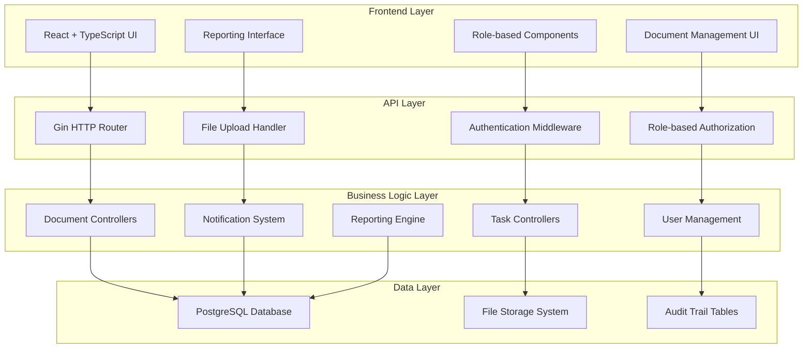
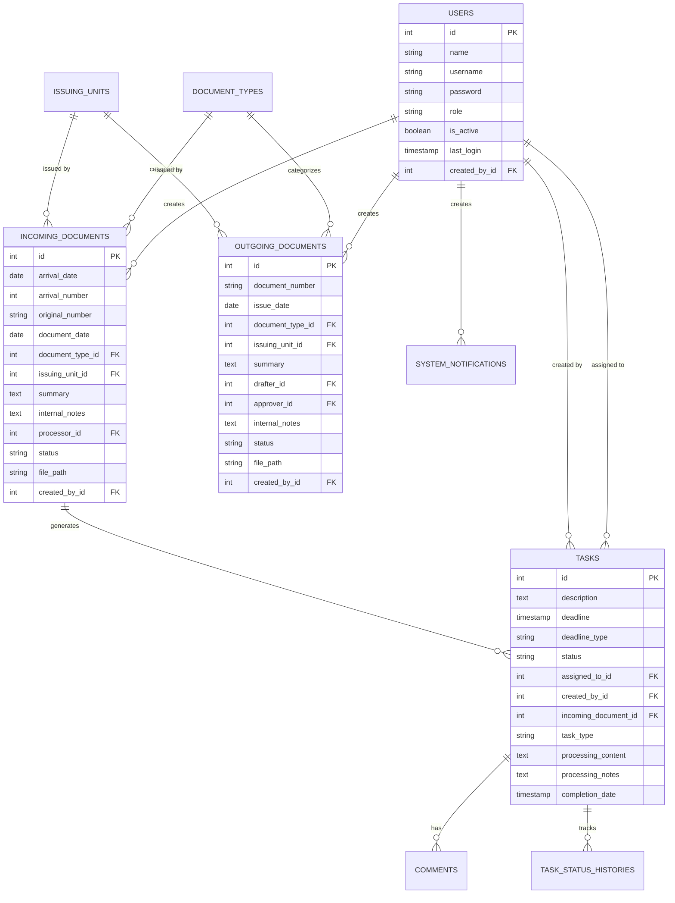

# Design Document

## Overview

This design document outlines the comprehensive enhancement of the existing document and task management system to fully implement the Vietnamese government document management requirements. The system will be transformed from a basic task management application into a full-featured document workflow system supporting incoming documents, outgoing documents, task assignments, and comprehensive reporting.

The enhanced system will maintain the existing Go backend with Gin framework and React frontend with TypeScript, while significantly expanding the data models, API endpoints, and user interfaces to support the complex workflow requirements.

## Architecture

### High-Level Architecture



### System Components

1. **Enhanced Authentication System**: Role-based access with password visibility toggle
2. **Document Management System**: Comprehensive incoming and outgoing document handling
3. **Task Assignment Engine**: Flexible task creation and assignment with deadline management
4. **Notification System**: System-wide notifications and alerts
5. **Reporting Engine**: Comprehensive reporting with filtering and export capabilities
6. **Audit Trail System**: Complete document processing history tracking
7. **File Management System**: Secure file upload, storage, and retrieval

## Components and Interfaces

### Backend Components

#### Enhanced Data Models

**IncomingDocument Model**
```go
type IncomingDocument struct {
    gorm.Model
    ArrivalDate     time.Time `json:"arrival_date" gorm:"not null"`
    ArrivalNumber   int       `json:"arrival_number" gorm:"unique;not null"`
    OriginalNumber  string    `json:"original_number" gorm:"not null"`
    DocumentDate    time.Time `json:"document_date" gorm:"not null"`
    DocumentTypeID  uint      `json:"document_type_id" gorm:"not null"`
    IssuingUnitID   uint      `json:"issuing_unit_id" gorm:"not null"`
    Summary         string    `json:"summary" gorm:"not null"`
    InternalNotes   string    `json:"internal_notes"`
    ProcessorID     uint      `json:"processor_id"`
    Status          string    `json:"status" gorm:"not null"`
    FilePath        string    `json:"file_path"`
    CreatedByID     uint      `json:"created_by_id" gorm:"not null"`
    
    // Relations
    DocumentType    DocumentType `json:"document_type" gorm:"foreignkey:DocumentTypeID"`
    IssuingUnit     IssuingUnit  `json:"issuing_unit" gorm:"foreignkey:IssuingUnitID"`
    Processor       User         `json:"processor" gorm:"foreignkey:ProcessorID"`
    CreatedBy       User         `json:"created_by" gorm:"foreignkey:CreatedByID"`
    Tasks           []Task       `json:"tasks" gorm:"foreignkey:IncomingDocumentID"`
}
```

**OutgoingDocument Model**
```go
type OutgoingDocument struct {
    gorm.Model
    DocumentNumber  string    `json:"document_number" gorm:"not null"`
    IssueDate       time.Time `json:"issue_date" gorm:"not null"`
    DocumentTypeID  uint      `json:"document_type_id" gorm:"not null"`
    IssuingUnitID   uint      `json:"issuing_unit_id" gorm:"not null"`
    Summary         string    `json:"summary" gorm:"not null"`
    DrafterID       uint      `json:"drafter_id" gorm:"not null"`
    ApproverID      uint      `json:"approver_id" gorm:"not null"`
    InternalNotes   string    `json:"internal_notes"`
    Status          string    `json:"status" gorm:"not null"`
    FilePath        string    `json:"file_path"`
    CreatedByID     uint      `json:"created_by_id" gorm:"not null"`
    
    // Relations
    DocumentType    DocumentType `json:"document_type" gorm:"foreignkey:DocumentTypeID"`
    IssuingUnit     IssuingUnit  `json:"issuing_unit" gorm:"foreignkey:IssuingUnitID"`
    Drafter         User         `json:"drafter" gorm:"foreignkey:DrafterID"`
    Approver        User         `json:"approver" gorm:"foreignkey:ApproverID"`
    CreatedBy       User         `json:"created_by" gorm:"foreignkey:CreatedByID"`
}
```

**Enhanced Task Model**
```go
type Task struct {
    gorm.Model
    Description         string    `json:"description" gorm:"not null"`
    Deadline            time.Time `json:"deadline"`
    DeadlineType        string    `json:"deadline_type"` // "specific", "monthly", "quarterly", "yearly"
    Status              string    `json:"status" gorm:"not null"`
    AssignedToID        uint      `json:"assigned_to_id"`
    CreatedByID         uint      `json:"created_by_id" gorm:"not null"`
    IncomingDocumentID  *uint     `json:"incoming_document_id"` // Nullable for independent tasks
    TaskType            string    `json:"task_type"` // "document_linked", "independent"
    ProcessingContent   string    `json:"processing_content"`
    ProcessingNotes     string    `json:"processing_notes"`
    CompletionDate      *time.Time `json:"completion_date"`
    
    // Relations
    AssignedTo          User              `json:"assigned_to" gorm:"foreignkey:AssignedToID"`
    CreatedBy           User              `json:"created_by" gorm:"foreignkey:CreatedByID"`
    IncomingDocument    *IncomingDocument `json:"incoming_document" gorm:"foreignkey:IncomingDocumentID"`
    Comments            []Comment         `json:"comments" gorm:"foreignkey:TaskID"`
    StatusHistory       []TaskStatusHistory `json:"status_history" gorm:"foreignkey:TaskID"`
}
```

**System Configuration Models**
```go
type DocumentType struct {
    gorm.Model
    Name        string `json:"name" gorm:"unique;not null"`
    Description string `json:"description"`
    IsActive    bool   `json:"is_active" gorm:"default:true"`
}

type IssuingUnit struct {
    gorm.Model
    Name        string `json:"name" gorm:"unique;not null"`
    Description string `json:"description"`
    IsActive    bool   `json:"is_active" gorm:"default:true"`
}

type ReceivingUnit struct {
    gorm.Model
    Name        string `json:"name" gorm:"unique;not null"`
    Description string `json:"description"`
    IsActive    bool   `json:"is_active" gorm:"default:true"`
}

type SystemNotification struct {
    gorm.Model
    Title       string    `json:"title" gorm:"not null"`
    Content     string    `json:"content" gorm:"not null"`
    Type        string    `json:"type" gorm:"not null"` // "maintenance", "upgrade", "action_required"
    IsActive    bool      `json:"is_active" gorm:"default:true"`
    ExpiresAt   *time.Time `json:"expires_at"`
    CreatedByID uint      `json:"created_by_id" gorm:"not null"`
    
    // Relations
    CreatedBy   User      `json:"created_by" gorm:"foreignkey:CreatedByID"`
}

type TaskStatusHistory struct {
    gorm.Model
    TaskID      uint      `json:"task_id" gorm:"not null"`
    OldStatus   string    `json:"old_status"`
    NewStatus   string    `json:"new_status" gorm:"not null"`
    ChangedByID uint      `json:"changed_by_id" gorm:"not null"`
    Notes       string    `json:"notes"`
    
    // Relations
    Task        Task      `json:"task" gorm:"foreignkey:TaskID"`
    ChangedBy   User      `json:"changed_by" gorm:"foreignkey:ChangedByID"`
}
```

#### Enhanced API Controllers

**Document Controllers**
- `IncomingDocumentController`: Handle incoming document CRUD operations
- `OutgoingDocumentController`: Handle outgoing document CRUD operations
- `DocumentTypeController`: Manage document type configurations
- `IssuingUnitController`: Manage issuing unit configurations

**Enhanced Task Controllers**
- Extended task creation with document linking
- Flexible deadline management (specific dates, monthly, quarterly, yearly)
- Task forwarding and delegation
- Processing content and notes management

**System Management Controllers**
- `NotificationController`: System-wide notification management
- `ReportController`: Comprehensive reporting with filtering and export
- `AuditController`: Document processing audit trails
- `ConfigurationController`: System configuration management

#### Enhanced Middleware

**Role-based Authorization Enhancement**
```go
func RequireRoles(roles ...string) gin.HandlerFunc {
    return func(c *gin.Context) {
        userRole, exists := c.Get("user_role")
        if !exists {
            c.JSON(http.StatusUnauthorized, gin.H{"error": "Unauthorized"})
            c.Abort()
            return
        }
        
        for _, role := range roles {
            if userRole.(string) == role {
                c.Next()
                return
            }
        }
        
        c.JSON(http.StatusForbidden, gin.H{"error": "Insufficient permissions"})
        c.Abort()
    }
}
```

### Frontend Components

#### Enhanced Authentication
- Password visibility toggle component
- Role-based route protection
- Session management with automatic logout

#### Role-specific Dashboards
- **Admin Dashboard**: System overview, user management, configuration
- **Secretary Dashboard**: Document entry, file management, basic reporting
- **Team Leader Dashboard**: Document processing, task assignment, team monitoring
- **Deputy Dashboard**: Assigned documents, task delegation, progress tracking
- **Officer Dashboard**: Task list, processing interface, personal reporting

#### Document Management Components
- **IncomingDocumentForm**: Comprehensive form for incoming document entry
- **OutgoingDocumentForm**: Outgoing document creation and approval workflow
- **DocumentList**: Filterable and sortable document listings
- **DocumentViewer**: Document details with file preview and processing history

#### Task Management Components
- **EnhancedTaskForm**: Task creation with document linking and flexible deadlines
- **TaskAssignmentInterface**: Drag-and-drop task assignment
- **TaskProgressTracker**: Visual progress tracking with timeline
- **TaskDelegationInterface**: Task forwarding and delegation management

#### Reporting Components
- **ReportBuilder**: Interactive report configuration
- **ReportViewer**: Formatted report display with print/export options
- **FilterInterface**: Advanced filtering for documents and tasks
- **ExportManager**: PDF and Excel export functionality

## Data Models

### Enhanced Database Schema

```sql
-- Enhanced Users table
ALTER TABLE users ADD COLUMN is_active BOOLEAN DEFAULT true;
ALTER TABLE users ADD COLUMN last_login TIMESTAMP;
ALTER TABLE users ADD COLUMN created_by_id INTEGER REFERENCES users(id);

-- Document Types table
CREATE TABLE document_types (
    id SERIAL PRIMARY KEY,
    name VARCHAR(255) UNIQUE NOT NULL,
    description TEXT,
    is_active BOOLEAN DEFAULT true,
    created_at TIMESTAMP DEFAULT CURRENT_TIMESTAMP,
    updated_at TIMESTAMP DEFAULT CURRENT_TIMESTAMP,
    deleted_at TIMESTAMP
);

-- Issuing Units table
CREATE TABLE issuing_units (
    id SERIAL PRIMARY KEY,
    name VARCHAR(255) UNIQUE NOT NULL,
    description TEXT,
    is_active BOOLEAN DEFAULT true,
    created_at TIMESTAMP DEFAULT CURRENT_TIMESTAMP,
    updated_at TIMESTAMP DEFAULT CURRENT_TIMESTAMP,
    deleted_at TIMESTAMP
);

-- Receiving Units table
CREATE TABLE receiving_units (
    id SERIAL PRIMARY KEY,
    name VARCHAR(255) UNIQUE NOT NULL,
    description TEXT,
    is_active BOOLEAN DEFAULT true,
    created_at TIMESTAMP DEFAULT CURRENT_TIMESTAMP,
    updated_at TIMESTAMP DEFAULT CURRENT_TIMESTAMP,
    deleted_at TIMESTAMP
);

-- Incoming Documents table
CREATE TABLE incoming_documents (
    id SERIAL PRIMARY KEY,
    arrival_date DATE NOT NULL,
    arrival_number INTEGER UNIQUE NOT NULL,
    original_number VARCHAR(255) NOT NULL,
    document_date DATE NOT NULL,
    document_type_id INTEGER NOT NULL REFERENCES document_types(id),
    issuing_unit_id INTEGER NOT NULL REFERENCES issuing_units(id),
    summary TEXT NOT NULL,
    internal_notes TEXT,
    processor_id INTEGER REFERENCES users(id),
    status VARCHAR(50) NOT NULL DEFAULT 'received',
    file_path VARCHAR(500),
    created_by_id INTEGER NOT NULL REFERENCES users(id),
    created_at TIMESTAMP DEFAULT CURRENT_TIMESTAMP,
    updated_at TIMESTAMP DEFAULT CURRENT_TIMESTAMP,
    deleted_at TIMESTAMP
);

-- Outgoing Documents table
CREATE TABLE outgoing_documents (
    id SERIAL PRIMARY KEY,
    document_number VARCHAR(255) NOT NULL,
    issue_date DATE NOT NULL,
    document_type_id INTEGER NOT NULL REFERENCES document_types(id),
    issuing_unit_id INTEGER NOT NULL REFERENCES issuing_units(id),
    summary TEXT NOT NULL,
    drafter_id INTEGER NOT NULL REFERENCES users(id),
    approver_id INTEGER NOT NULL REFERENCES users(id),
    internal_notes TEXT,
    status VARCHAR(50) NOT NULL DEFAULT 'draft',
    file_path VARCHAR(500),
    created_by_id INTEGER NOT NULL REFERENCES users(id),
    created_at TIMESTAMP DEFAULT CURRENT_TIMESTAMP,
    updated_at TIMESTAMP DEFAULT CURRENT_TIMESTAMP,
    deleted_at TIMESTAMP
);

-- Enhanced Tasks table
ALTER TABLE tasks ADD COLUMN incoming_document_id INTEGER REFERENCES incoming_documents(id);
ALTER TABLE tasks ADD COLUMN task_type VARCHAR(50) DEFAULT 'document_linked';
ALTER TABLE tasks ADD COLUMN deadline_type VARCHAR(50) DEFAULT 'specific';
ALTER TABLE tasks ADD COLUMN processing_content TEXT;
ALTER TABLE tasks ADD COLUMN processing_notes TEXT;
ALTER TABLE tasks ADD COLUMN completion_date TIMESTAMP;
ALTER TABLE tasks RENAME COLUMN assigned_to TO assigned_to_id;
ALTER TABLE tasks RENAME COLUMN created_by TO created_by_id;
ALTER TABLE tasks DROP COLUMN incoming_file_id;

-- Task Status History table
CREATE TABLE task_status_histories (
    id SERIAL PRIMARY KEY,
    task_id INTEGER NOT NULL REFERENCES tasks(id),
    old_status VARCHAR(50),
    new_status VARCHAR(50) NOT NULL,
    changed_by_id INTEGER NOT NULL REFERENCES users(id),
    notes TEXT,
    created_at TIMESTAMP DEFAULT CURRENT_TIMESTAMP,
    updated_at TIMESTAMP DEFAULT CURRENT_TIMESTAMP,
    deleted_at TIMESTAMP
);

-- System Notifications table
CREATE TABLE system_notifications (
    id SERIAL PRIMARY KEY,
    title VARCHAR(255) NOT NULL,
    content TEXT NOT NULL,
    type VARCHAR(50) NOT NULL,
    is_active BOOLEAN DEFAULT true,
    expires_at TIMESTAMP,
    created_by_id INTEGER NOT NULL REFERENCES users(id),
    created_at TIMESTAMP DEFAULT CURRENT_TIMESTAMP,
    updated_at TIMESTAMP DEFAULT CURRENT_TIMESTAMP,
    deleted_at TIMESTAMP
);

-- Drop old incoming_files table
DROP TABLE IF EXISTS incoming_files;
```

### Data Relationships



## Error Handling

### Backend Error Handling Strategy

1. **Validation Errors**: Comprehensive input validation with detailed error messages
2. **Authorization Errors**: Clear role-based access denial messages
3. **Database Errors**: Graceful handling of constraint violations and connection issues
4. **File Upload Errors**: Proper handling of file size, type, and storage errors
5. **Business Logic Errors**: Custom error types for workflow violations

### Frontend Error Handling

1. **API Error Interceptors**: Centralized error handling with user-friendly messages
2. **Form Validation**: Real-time validation with helpful error indicators
3. **Network Error Handling**: Offline detection and retry mechanisms
4. **File Upload Error Handling**: Progress indicators and error recovery

## Testing Strategy

### Backend Testing

1. **Unit Tests**: Individual controller and service method testing
2. **Integration Tests**: Database interaction and API endpoint testing
3. **Authentication Tests**: Role-based access control verification
4. **File Upload Tests**: File handling and storage testing

### Frontend Testing

1. **Component Tests**: Individual component functionality testing
2. **Integration Tests**: User workflow and API integration testing
3. **Role-based UI Tests**: Interface visibility and functionality by role
4. **Accessibility Tests**: Screen reader and keyboard navigation testing

### Test Data Management

1. **Database Seeding**: Comprehensive test data for all user roles and scenarios
2. **File Fixtures**: Sample documents for upload and processing testing
3. **Mock Services**: External service mocking for isolated testing
4. **Performance Testing**: Load testing for document processing workflows

## Security Considerations

### Authentication and Authorization

1. **JWT Token Security**: Secure token generation and validation
2. **Role-based Access Control**: Granular permission enforcement
3. **Session Management**: Secure session handling and timeout
4. **Password Security**: Strong password requirements and hashing

### Data Protection

1. **File Security**: Secure file upload, storage, and access control
2. **Data Encryption**: Sensitive data encryption at rest and in transit
3. **Audit Logging**: Comprehensive activity logging for security monitoring
4. **Input Sanitization**: Protection against injection attacks

### System Security

1. **CORS Configuration**: Proper cross-origin request handling
2. **Rate Limiting**: API endpoint protection against abuse
3. **File Type Validation**: Strict file type and size validation
4. **Database Security**: Connection security and query parameterization

## Performance Considerations

### Database Optimization

1. **Indexing Strategy**: Optimized indexes for frequent queries
2. **Query Optimization**: Efficient queries with proper joins and filtering
3. **Connection Pooling**: Optimized database connection management
4. **Data Archiving**: Historical data management and archiving

### Frontend Performance

1. **Code Splitting**: Lazy loading of role-specific components
2. **Caching Strategy**: Efficient API response caching
3. **Image Optimization**: Optimized document preview and thumbnails
4. **Bundle Optimization**: Minimized JavaScript bundle sizes

### File Handling Performance

1. **Streaming Uploads**: Large file upload optimization
2. **File Compression**: Document compression for storage efficiency
3. **CDN Integration**: Fast file delivery through content delivery networks
4. **Thumbnail Generation**: Efficient document preview generation